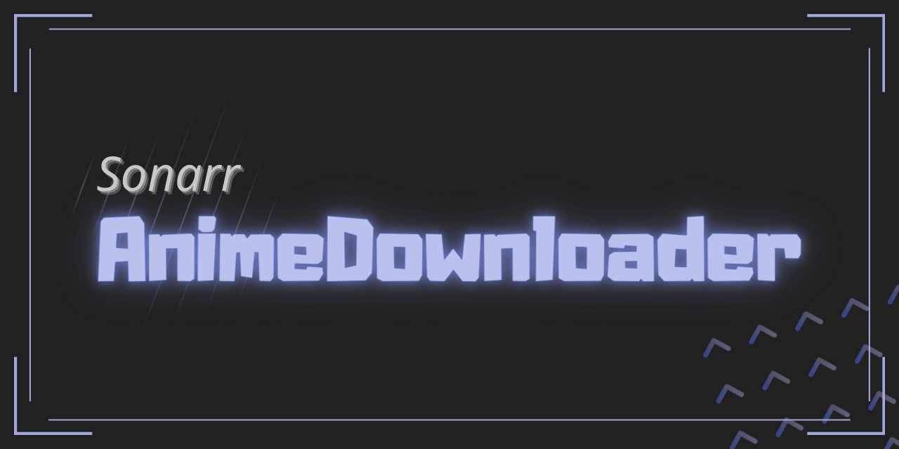
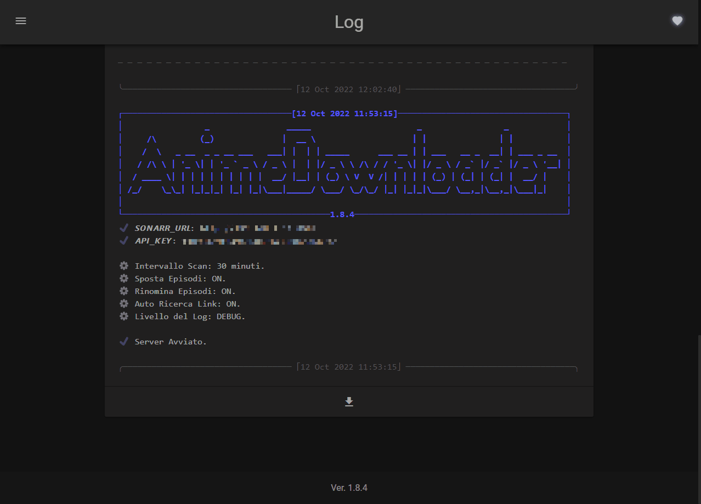

# 

[](../../releases)   [](../../issues)   [](/LICENSE)   [](../../stargazers)

_This documentation is in **Italian** because this program downloads anime with italian subtitles only._

Questo Docker Container funziona come un'estenzione di [Sonarr](https://sonarr.tv/); serve a scaricare in automatico tutti gli anime che non vengono condivisi tramite torrent.
Il Container si interfaccia con Sonarr per avere informazini riguardante gli anime mancanti sull'hard-disk, viene poi fatta una ricerca se sono presenti sul sito [AnimeWorld](https://www.animeworld.so/), e se ci sono li scarica e li posiziona nella cartella indicata da Sonarr.

L'utilizzo di _**Sonarr**_ è necessario.
Il _Docker Container_ di **Sonarr** può essere trovato [qui](https://github.com/linuxserver/docker-sonarr).

Il progetto utilizza la libreria `animeworld`, il codice sorgente e la documentazione è reperibile [qui](../../../AnimeWorld-API).

## Novità di questo fork

- **Download simultanei**: gli episodi mancanti vengono ora scaricati in parallelo (fino a 10 download contemporanei per impostazione predefinita) invece che uno alla volta, velocizzando sensibilmente il recupero di grandi quantità di episodi arretrati. Il numero massimo di download simultanei è configurabile dalla pagina **Settings** dell'interfaccia web (parametro "Download Simultanei").

## Hacktoberfest

Per partecipare all'evento Hacktoberfest leggere la [documentazione](https://mainkronos.github.io/Sonarr-AnimeDownloader/community/hacktoberfest/).\
**Per contribuire non è necessario saper programmare o mettere mano al codice sorgente del programma.**

## Installazione

```yaml
version: '3.9'
services:
  mainkronos:
    container_name: AnimeDownloader
    volumes:
      - '/path/to/data:/src/database'
      - '/path/to/animeSeries:/tv'
      - '/path/to/downloads:/downloads'
      - '/path/to/connections:/src/script'
    ports:
      - 'port:5000'
    environment:
      - 'SONARR_URL=http://url:port'
      - 'API_KEY=1234567890abcdefghijklmn'
      - 'ANIMEWORLD_URL=https://www.animeworld.ac'
      - 'TZ=Europe/Rome'
      - 'PUID=1000'
      - 'PGID=1000'
    image: 'ghcr.io/mainkronos/anime_downloader:latest'
```

## [Documentazione](https://mainkronos.github.io/Sonarr-AnimeDownloader)

La documentaszione con tutte le informazioni di installazione e configurazione sono disponibili [qui](https://mainkronos.github.io/Sonarr-AnimeDownloader).

Per iniziare ad utilizzare il programma vai alla sezione [QuickStart](https://mainkronos.github.io/Sonarr-AnimeDownloader/usage/quickstart).

Se vuoi saperne di più sulle funzionalità avanzate vai alla sezione [Advanced Usage](https://mainkronos.github.io/Sonarr-AnimeDownloader/usage/advanced).

In caso di dubbi o problemi consolutare le [FAQ](https://mainkronos.github.io/Sonarr-AnimeDownloader/usage/faq).

Se vuoi contribuire al progetto dai un occhiata alla sezione [Contributing](https://mainkronos.github.io/Sonarr-AnimeDownloader/community/contributing).

Un esempio di interfaccia e funzionamento del programma:



Se il progetto ti è _**piaciuto**_ aggiungi una [**STELLA**](https://github.com/MainKronos/Sonarr-AnimeDownloader/stargazers). 👈(ﾟヮﾟ👈)

## Sponsor

> **Grazie di cuore a tutti coloro che hanno donato** per questo progetto. \
> Il vostro supporto mi ha permesso di raggiungere **risultati straordinari**.

[](https://github.com/sponsors/MainKronos)

## Star History


