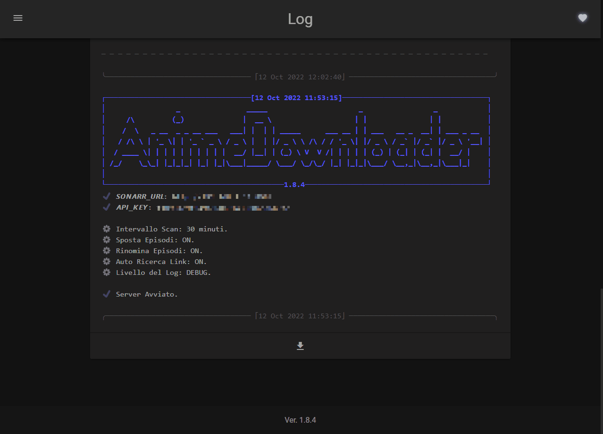

# 

         

---

_This documentation is in **Italian** because this program downloads anime with italian subtitles only._

Questo Docker Container funziona come un'estenzione di [Sonarr](https://sonarr.tv/); serve a scaricare in automatico tutti gli anime che non vengono condivisi tramite torrent.
Il Container si interfaccia con Sonarr per avere informazini riguardante gli anime mancanti sull'hard-disk, viene poi fatta una ricerca se sono presenti sul sito [AnimeWorld](https://www.animeworld.so/), e se ci sono li scarica e li posiziona nella cartella indicata da Sonarr.

Un esempio di interfaccia e funzionamento del programma:

L'utilizzo di _**Sonarr**_ è necessario.
Il _Docker Container_ di **Sonarr** può essere trovato [qui](https://github.com/linuxserver/docker-sonarr).

Il progetto utilizza la libreria `animeworld`, il codice sorgente e la documentazione è reperibile [qui](https://github.com/MainKronos/AnimeWorld-API).

## Documentazione

Per iniziare ad utilizzare il programma vai alla sezione [QuickStart](usage/quickstart.md).

Se vuoi saperne di più sulle funzionalità avanzate vai alla sezione [Advanced Usage](usage/advanced.md).

In caso di dubbi o problemi consolutare le [FAQ](usage/faq.md).

Se vuoi contribuire al progetto dai un occhiata alla sezione [Contributing](community/contributing.md).

Se il progetto ti è _**piaciuto**_ aggiungi una [**STELLA**](https://github.com/MainKronos/Sonarr-AnimeDownloader/stargazers). 👈(ﾟヮﾟ👈)

