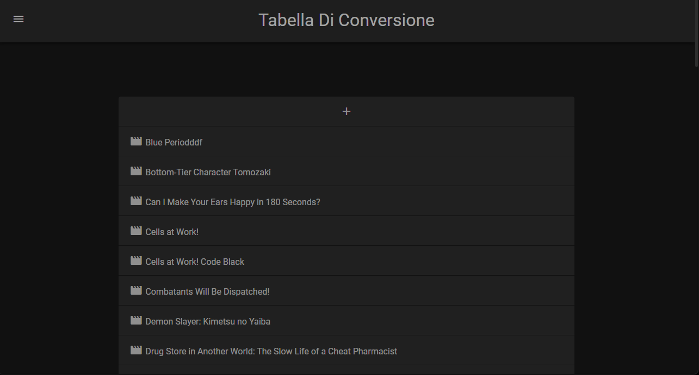
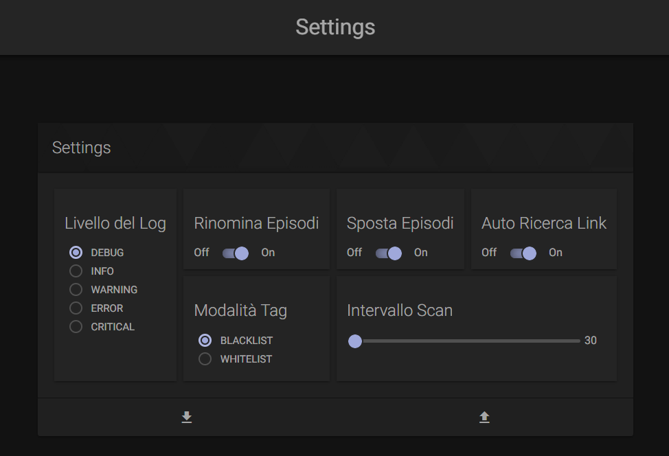
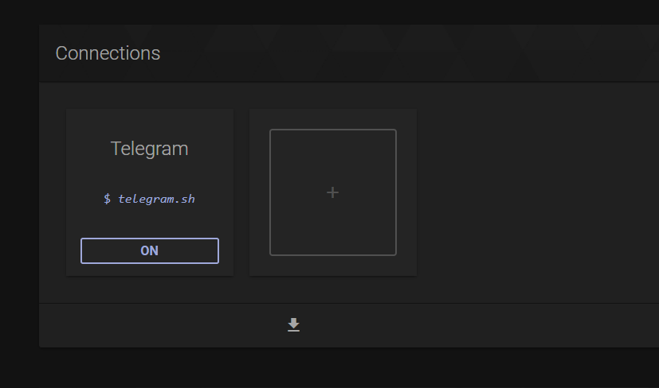
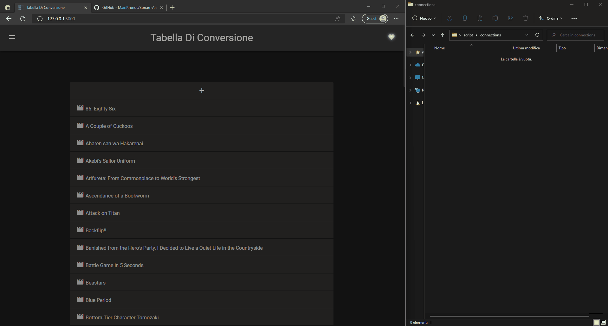
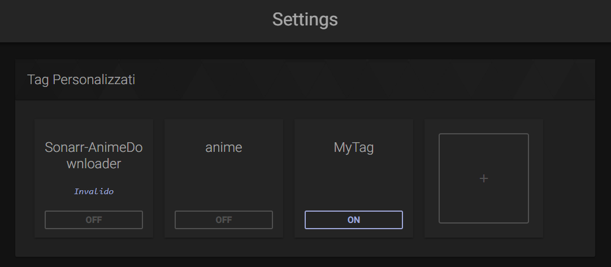
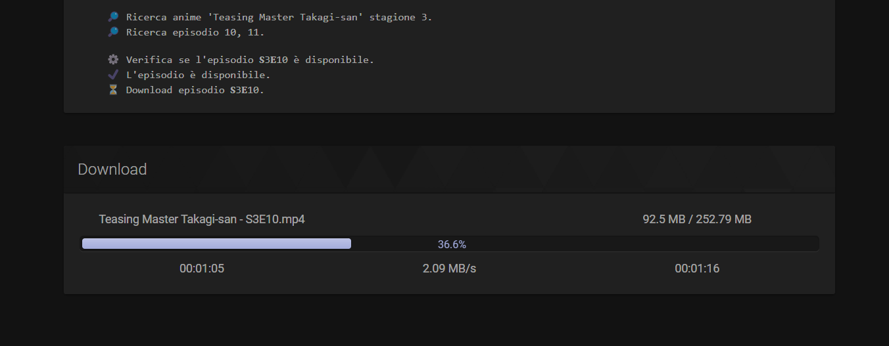
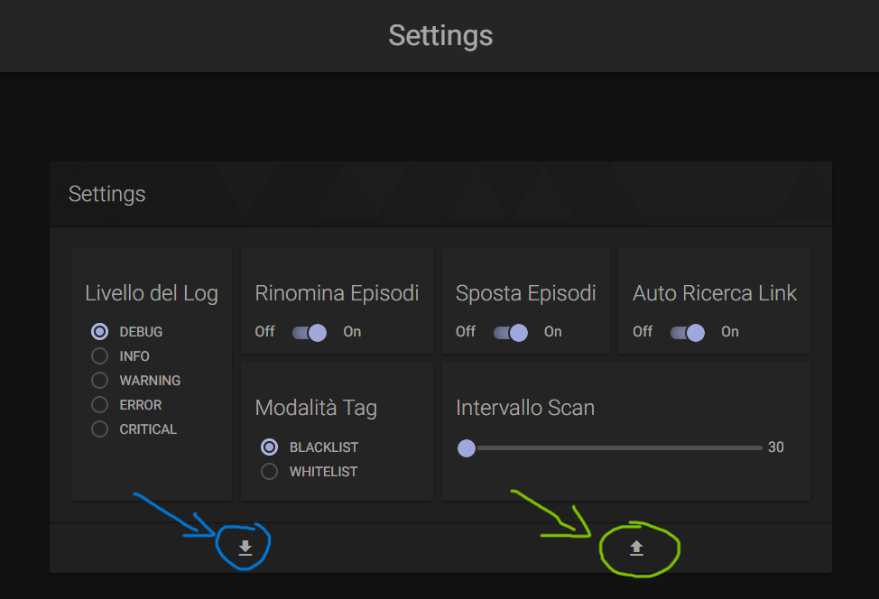

# Advanced Usage

## Tabella di Conversione

È possibile cancellare o modificare link/stagione/anime presente nella tabella di conversione, per farlo è sufficiente premere tasto destro sull'elemento che si vuole modificare/cancellare e premere Edit/Delete.

Nel caso in cui si voglia modificare, dopo aver premuto Edit, apparirà un input dove si potrà inserire la modifica; per confermare la modifica bisogna premere il tasto ++enter++ altrimenti per annularla premere il tasto ++escape++.

Se l'input perde il focus e non è stata rilevata nessuna modifica, l'input scomparirà automaticamente.

## Settings

Questo è il pannello delle impostazioni, si può accedere da `http://localhost:5000/settings` o cliccando sul pulsante `Settings` nella barra laterale a sinistra della pagina principale.

Tutte le impostazioni sono descritte nella tabella sottostante.

|Parametro|Descrizione|
|:---:|:---|
|**Livello del Log** | Indica quale tipo di messaggi mostrare nei log. Sconsiglio fortemente di impostare un livello superiore a `INFO`.|
|**Rinomina Episodi** | Indica se gli episodi devono essere rinominati secondo la formattazione impostata su *Sonarr* (`http://sonarr-url/settings/mediamanagement` in `Episode Naming`).|
|**Sposta Episodi** | Indica se gli episodi devono essere spostati nella cartella indicata da *Sonarr* oppure lasciarli nella cartella interna al container (`/downloads`).|
|**Intervallo Scan** | Indica quanto tempo deve passare (in minuti) tra una ricerca degli episodi e un'altra. (Il tempo minimo è 30 minuti)|
|**Auto Ricerca Link** | Ricerca automaticamente i link che non sono presenti nella tabella di conversione. In caso di successo verrà inviata una notifica tramite [connection](#connections).|
|Modalità Tag | Indica la modalità di gestione dei [tag](#tag) associati agli anime su sonarr. Se è in moalità `BLACKLIST` le serie che hanno almeno un [tag](#tag) attivo nella sezione **Tag Personalizzati** saranno escluse dalla ricerca; se è in modalità `WHITELIST` le serie che **NON** hanno almeno un [tag](#tag) attivo nella sezione **Tag Personalizzati** saranno escluse.|

!!! Note
    Se la modalità tag è `WHITELIST`, e non è stata aggiunto nessun [tag](#tag) alla sezione **Tag Personalizzati** o nessun tag è attivo, allora **TUTTi** gli anime saranno esclusi.

## Connections

Le connection sono Shell Script scritti in Bash che vengono eseguiti quando deve essere inviato un messaggio tramite un servizio esterno (tipo Telegram). Sono un po' meno user friendly ma altamente personalizzabili! Alcuni template possono essere trovati in questa [cartella](https://github.com/MainKronos/Sonarr-AnimeDownloader/tree/main/docs/static/examples/connections).

Per utilizzarle è necessario prima scrive lo script in modo tale che possa ricevere un parametro (`$1`) che identifica il messaggio da inviare, poi salvare con estensione `.sh` e posizionarlo nella cartella `/script/connections`. Infine accedere alla pagina web, nella sezioni impostazioni, aggiungerlo e attivarlo.

## Tag

I tag sono delle etichette che possono essere assegnate alle serie su Sonarr. Qui vengono usati come filtro per escludere o includere le serie nella ricerca degli episodi.

Per aggiungere un nuovo tag basta premere il pulsante `+` e aggiungere un nome di un tag **già presente** su Sonarr. 
Per attivarne uno basta premere il pulsante in basso; se è visualizzato `ON` è attivo se invece è `OFF` è spento. 
Se viene visualizzata la scritta `Invalido` significa che quel tag è stato rimosso da Sonarr e quindi non è più valido (non può essere attivato).

Il funzionamento dei tag varia a seconda della modalità settata nelle impostazioni; può essere in modalità `BLACKLIST` (default) o `WHITELIST`, per maggiori informazioni gurdare la sezione [Settings](#settings).

## Log

È possibile visualizzare i log in tempo reale, per farlo basta cliccare sul pulsante `Log` nella barra laterale a destra della pagina principale.

Quando è in corso un download appare una barra di caricamento che indica il progresso del download con le relative informazioni (nome file, dimensione, velocità, ecc...).

## Load/Unload

È possibile caricare e scaricare le configurazioni, delle impostazioni, della tabella di conversione, dei tag, etc.. 

Per scaricare la configurazione basta cliccare sul pulsante ':material-download:' sotto la sezione che si vuole scaricare, mentre per caricarla basta cliccare sul pulsante ':material-upload:' e selezionare il file da caricare.

!!! Warning
    I file che vengono scaricati sono gli stessi che si trovano all'interno del container. Quindi se si caricano delle nuove configurazioni, queste sovrascriveranno quelle presenti nel container.

