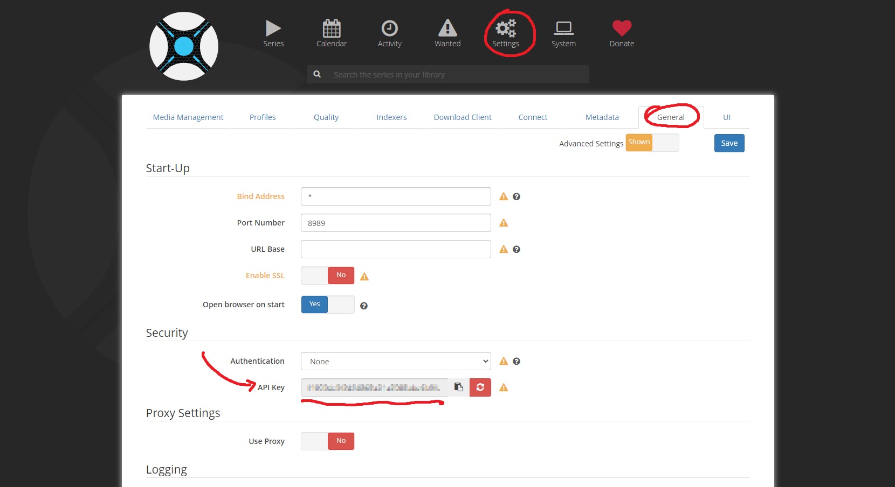
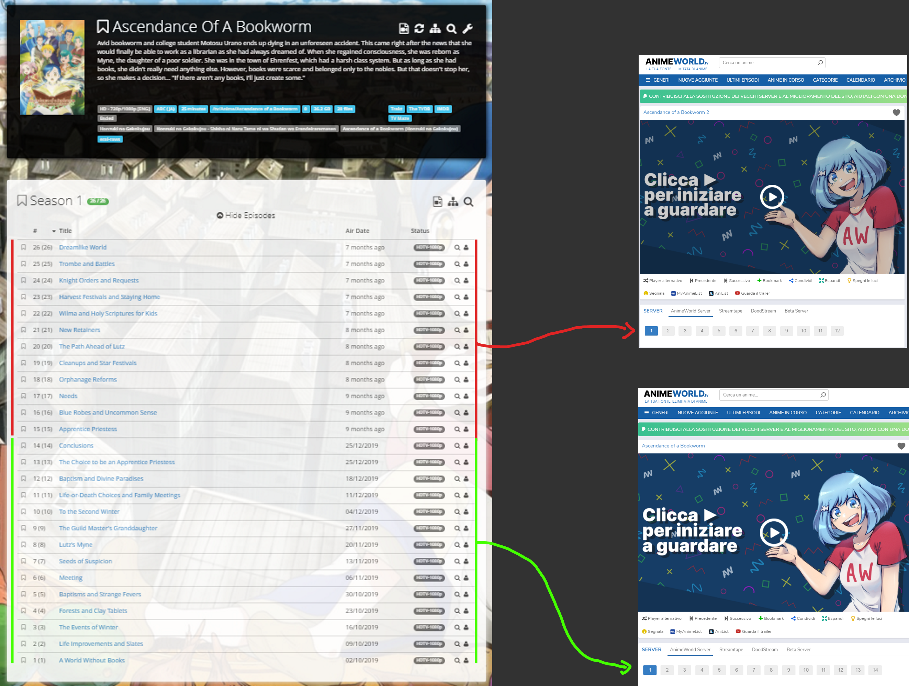
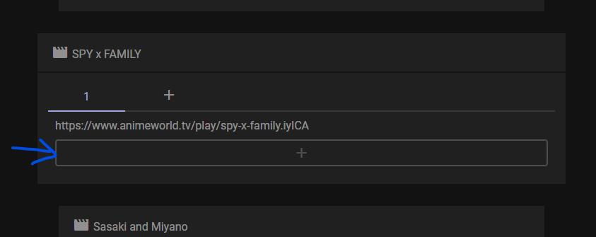
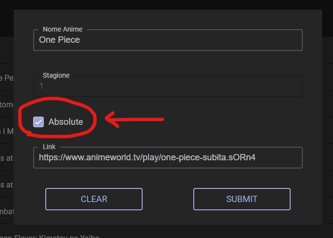
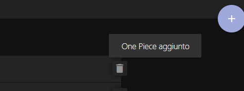
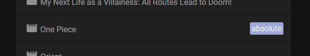
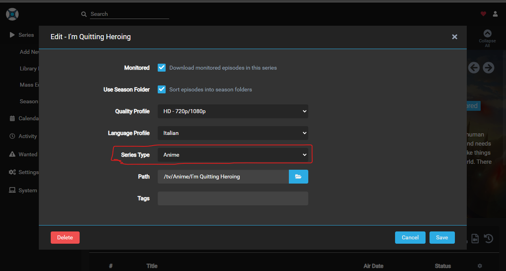
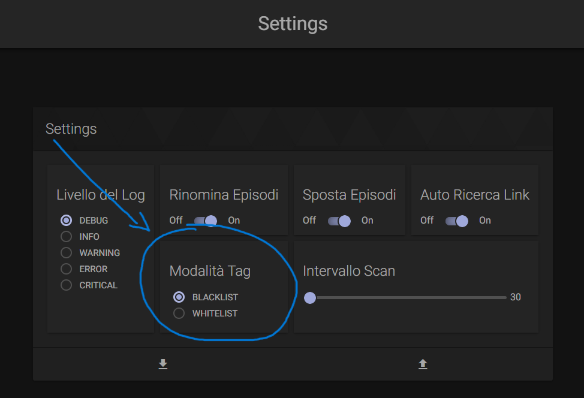

# FAQ

## Dove posso reperire la chiave api di sonarr?


## Dove posso reperire la Chat ID di telegram?
Prima di reperire la Chat ID è necessario aver già creato un Bot Telegram, e per farlo basta continuare a leggere [qui](#dove-posso-reperire-il-token-per-il-bot-di-telegram).

Dopo aver creato il bot Telegram, bisogna inviargli un messaggio di prova con scritto qualsiasi cosa, serve per attivare la chat.
Poi bisogna andare su questa 'pagina':
```
https://api.telegram.org/bot<YourBOTToken>/getUpdates
```
Lì ci saranno scritte un po' di informazioni tipo queste riportate sotto, la vostra Chat ID si trova lì da qualche parte:
```json
{
    "ok":true,
    "result":[{
        "update_id":379225167,
        "message":{
            "message_id":5,
            "from":{
                "id":123456789,
                "first_name":"MyName",
                "language_code":"it-IT"
            },"chat":{
                "id":987654321, // Chat ID
                "first_name":"MyName",
                "type":"private"
            },
            "date":123456,
            "text":"hello"
        }
    }]
}
```

## Dove posso reperire il Token per il Bot di telegram?
Per prima cosa bisogna creare il proprio bot Telegram e per farlo basta seguire [queste](https://core.telegram.org/bots#3-how-do-i-create-a-bot) istruzioni.
Il token verrà generato alla creazione del bot. Leggere [qui](https://core.telegram.org/bots#6-botfather) per ulteriori informazioni.

## Ho aggiornato alla nuova versione del container e adesso non funziona più nulla
Alcune volte faccio modifiche importanti al programma, se riscontrate questo tipo di problema per favore controllate il [changelog](https://github.com/MainKronos/Sonarr-AnimeDownloader/releases).

## Una stagione di Sonarr è composta da due stagioni di AnimeWorld


Per riuscire a dire al programma che una stagione di Sonarr sono due di AnimeWold basta aggiunge all'Array dei link di AnimeWold per quella stagione di Sonarr anche il link di AnimeWold della seconda stagione.

Per l'esempio mostrato nell'immagine la sua formattazione nel `table.json` sarebbe:
```json
[    
    ...
    {
        "title": "Ascendance of a Bookworm",
        "seasons": {
            "1": [
                "https://www.animeworld.so/play/ascendance-of-a-bookworm.paCPb",
                "https://www.animeworld.so/play/ascendance-of-a-bookworm-2.Q0Rrm"
            ]
        }
    },
    ...
]
```

**È altamente consigliato usare la _pagina web_ alla porta `5000` per l'inserimento di queste informazioni.**
Per aggiungere un campo, in questo caso un nuovo link all'array, è sufficiente selezionare la stagione a cui corrispondono su Sonarr gli episodi da scaricare, e aggiungere il link relativo alla seconda/terza/... parte.



!!! Tip
    Per ricordarti come configurare correttamente il programma in questi casi basta pensare che, il numero subito sotto il titolo dell'anime si riferisce alla stagione di Sonarr e i link sotto si riferiscono a dove si trovano gli episodi relativi a quella stagione.

!!! Success
    Il problema è stato trattato [qui](https://github.com/MainKronos/Sonarr-AnimeDownloader/issues/93#issuecomment-1435927555).

## AnimeWorld Segue una numerazione Assoluta degli episodi 
Se AnimeWorld segue una numerazione Assoluta degli episodi, come ad esempio 'One Piece', selezionare nella pagina web, nel Modal per l'aggiunta di un anime, la checkbox `absolute`. Di conseguenza il campo `Season` deve essere vuoto.




Se tutto è stato inserito correttamente apparirà un toast tipo questo:




E nell'elenco delle serie si potrà riconoscere facilmente gli anime impostati con un ordinamento assoluto grazie ad una targhettina come questa:




## Uso Sonarr, ma non con Docker, e non sò quale mount dovrei fare
Se Sonarr non è installato tramite Docker, per riuscire a trovare la giusta cartella da collegare nel Container `Sonarr-AnimeDownloader` ti basta soltanto mantare le cartelle conteneti gli anime nella stessa posizione.
Ad esempio se hai la tua cartella degli anime nella posizione `/myfolder/myanime` il comando corretto sarà questo: `-v /myfolder/myanime:/myfolder/myanime`.

!!! Success
    Il problema è stato trattato [qui](https://github.com/MainKronos/Sonarr-AnimeDownloader/issues/9#issuecomment-774676181).

## Ho bisogno fare di più mount
Se hai bisogno di fare più mount non c'è nessun problema basta però mantenere lo stesso schema delle cartelle gestite da Sonarr.
Ad esempio:
> Hai una parte degli anime si trovano su  `/myfolder/myanime`
> L'altra parte degli anime si trovano su  `/myfolder2/myanimeOther`  

La soluzione sarebbe di fare così:
```
-v /myfolder/myanime:/myfolder/myanime
-v /myfolder2/myanimeOther:/myfolder2/myanimeOther
```

!!! Success
    Il problema è stato trattato [qui](https://github.com/MainKronos/Sonarr-AnimeDownloader/issues/9#issuecomment-774676181).

## Uso Sonarr in ambiente Windows, come devo fare il mount?
Non c'è problema se Sonarr è in esecuzione su Windows, basta solo prestare attenzione alle cartelle.
Ad esempio, abbiamo 3 cartelle da collegare:
```
H:\Anime2\
H:\FanSeries\
E:\Anime3\
```
La soluzione è fare in questo modo:
```
-v H:\Anime2\:/Anime2
-v H:\FanSeries\:/FanSeries
-v E:\Anime3\:/Anime3
```

!!! Success
    Il problema è stato trattato [qui](https://github.com/MainKronos/Sonarr-AnimeDownloader/issues/9#issuecomment-774692933).

## Cosa significa che la serie è stata scartata per mancanza di informazioni?

Significa che quella stagione non ha ancora una numerazione assoluta su Sonarr.

**Soluzione**: Attendi che qualcuno aggiunga la numerazione assoluta su [TheTVDB](https://thetvdb.com/), oppure aggiungila tu stesso.

## La serie non compare nei log

Se la serie non compare nei log controllare:

1. Che la tipologia della serie sia `anime`. 
2. Che l'url e l'API Key di Sonarr siano corretti.
3. Che la serie non sia stata esclusa a causa di qualche [tag](advanced.md#tag) o che la [modalità dei tag](#whitelist-e-blacklist) sia configurata male.

Se il problema è ancora presente allora aprire un issue.

!!! Success
    Il problema è stato trattato [qui](https://github.com/MainKronos/Sonarr-AnimeDownloader/issues/46).

## Whitelist e Blacklist



La modalità tag può avere due possibili valori `BLACKLIST` o `WHITELIST`. Il funzionamento è il seguente:

- `BLACKLIST`: vengono **ignorati** tutti gli anime che hanno almeno un [tag](advanced.md#tag) attivo nella sezione [Tag Personalizzati](advanced.md#tag);
- `WHITELIST`: vengono **scaricati** solo gli anime che hanno almeno un [tag](advanced.md#tag) attivo nella sezione [Tag Personalizzati](advanced.md#tag);

!!! Tip
    Se la lista dei tag è vuota o nessun tag è attivo, usa la modalità `BLACKLIST`, altrimenti tutti gli anime verranno scartati in modalità `WHITELIST`, per maggiori informazioni consultare la sezione [Advanced Usage](advanced.md#settings)

!!! Success
    Il problema è stato trattato [qui](https://github.com/MainKronos/Sonarr-AnimeDownloader/issues/150).

## Non trovo nessuna soluzione al mio problema

Se non hai trovato nessuna soluzione pertinente tra le FAQ, allora è possibile cercare tra gli issue se il problema è già stato trattato (guardare [qui](https://github.com/MainKronos/Sonarr-AnimeDownloader/issues?q=is%3Aissue+label%3A%22help+wanted%22%2Cquestion%2Cdocumentation+-label%3A%22fixed+on+dev%22))

Se ancora non hai trovato nessuna soluzione allora ti consiglio di aprire un issue (usare [questo template](https://github.com/MainKronos/Sonarr-AnimeDownloader/issues/new?assignees=MainKronos&labels=question&template=question.md&title=%5BQUESTION%5D+Titolo+domanda))