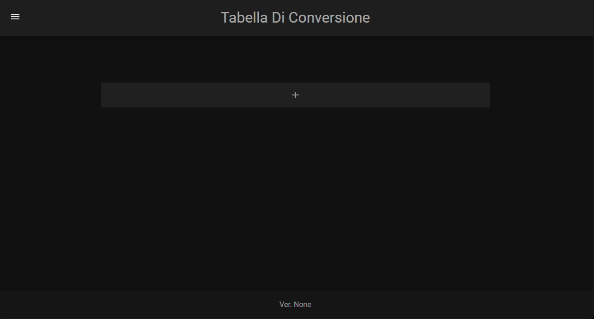

# QuickStart

## Utilizzo

Per avviare il container è possibile farlo attraverso [_docker cli_](#docker-cli) o tramite [_docker-compose_](#docker-compose).

### [Docker Compose](https://docs.linuxserver.io/general/docker-compose)

```yaml
version: '3.9'
services:
  mainkronos:
    container_name: AnimeDownloader
    volumes:
      - '/path/to/data:/src/database'
      - '/path/to/animeSeries:/tv'
      - '/path/to/downloads:/downloads'
      - '/path/to/connections:/src/script'
    ports:
      - 'port:5000'
    environment:
      - 'SONARR_URL=http://url:port'
      - 'ANIMEWORLD_URL=https://www.animeworld.ac'
      - 'API_KEY=1234567890abcdefghijklmn'
      - 'TZ=Europe/Rome'
      - 'PUID=1000'
      - 'PGID=1000'
    image: 'ghcr.io/mainkronos/anime_downloader:latest'
```


### [Docker CLI](https://docs.docker.com/engine/reference/commandline/cli/)


!!! Note inline end
    In ambiente **Windows** è utilizzato il carattere `^` per fare un comando su più righe, in ambiente **Linux** è utilizzato il carattere `\`.

```bash
docker run -d \
    --name=AnimeDownloader \
    -v /path/to/data:/src/database \
    -v /path/to/animeSeries:/tv \
    -v /path/to/downloads:/downloads \
    -v /path/to/connections:/src/script \
    -p port:5000 \
    --env SONARR_URL='http://url:port' \
    --env ANIMEWORLD_URL='https://www.animeworld.ac' \
    --env API_KEY='1234567890abcdefghijklmn' \
    --env TZ=Europe/Rome \
    --env PUID=1000 \
    --env PGID=1000 \
    ghcr.io/mainkronos/anime_downloader:latest
```

### Parametri

Le immagini del Docker Container vengono configurate utilizzando i parametri passati in fase di esecuzione (come quelli sopra). Questi parametri sono separati da due punti e indicano rispettivamente `<esterno>:<interno>` al Container.

???+ Tip
    Ad esempio, `-v /path/to/data:/src/database` indica che la cartella nella posizione `/path/to/data` si trova in `/src/database` all'interno del Container, quindi tutto il contento di `/path/to/data` è anche in `/src/database` all'interno del Container.

Parametro | Necessario | Funzione
 :---: | :---: | :---
`--name` | :material-close-thick: | Indica il nome del Container, può essere qualsiasi cosa
`-v /tv` | :material-check-bold: | Posizione della libreria Anime su disco, vedi sotto per ulteriori informazioni
`-v /src/database` | :material-check-bold: | Contiene file di configurazione
`-v /downloads` | :material-close-thick: | Cartella dove verranno scaricati tutti gli episodi (poi verranno spostati nella giusta cartella di destinazione)
`-v /src/script` | :material-close-thick: | Contiene file di configurazione per le [Connections](advanced.md#connections)
`-p {port}:5000` | :material-check-bold: | La porta per la pagina web
`--env SONARR_URL` | :material-check-bold: | Url di Sonarr es. http://localhost:8989
`--env ANIMEWORLD_URL` |:material-close-thick: | Url base di animeworld, se non definito il valore di default è `https://www.animeworld.ac`
`--env API_KEY` | :material-check-bold: | Api key di sonarr, vedi sotto per ulteriori informazioni
`--env TZ` | :material-check-bold: | Specifica un fuso orario, è necessario per il corretto funzionamento del Container
`--env PUID` | :material-close-thick: | Specifica UserID. Vedi sotto per maggiori informazioni
`--env PGID` | :material-close-thick: | Specifica GroupID. Vedi sotto per maggiori informazioni

#### Volume `/tv`
È importante, per il corretto funzionamento del container, che il volume legato alla directory `/tv` sia identico a quello usato per la configurazione di [**Sonarr**](https://docs.linuxserver.io/images/docker-sonarr).
Esempio
```bash title="linuxserver/sonarr" hl_lines="8"
docker run -d \
  --name=sonarr \
  -e PUID=1000 \
  -e PGID=1000 \
  -e TZ=Europe/London \
  -p 8989:8989 \
  -v /path/to/data:/config \
  -v /path/to/tvseries:/tv \ # <----- IMPORTANTE
  -v /path/to/downloadclient-downloads:/downloads \
  --restart unless-stopped \
  ghcr.io/linuxserver/sonarr
```
???+ Tip
    Ad esempio se su Sonarr la cartella tv è mappata così: `-v /path/to/tvseries:/tv` allora su anime_downloader sarà `-v /path/to/animeSeries:/tv`, oppure se è `-v /path/to/tvseries:/miatv/perf/miacartella` diventerà `-v /path/to/animeSeries:/miatv/perf/miacartella`...

#### User / Group Identifiers
Quando si utilizzano i volumi (-v flag) possono sorgere dei problemi di autorizzazione tra il sistema operativo host e il contenitore, il problema può essere evitato specificando il `PUID` utente e il `PGID` di gruppo.

Assicurati che tutte le directory di volume sull'host siano di proprietà dello stesso utente che hai specificato e qualsiasi problema di autorizzazione svanirà come per magia.

In questo caso `PUID=1000` e `PGID=1000`, per trovare il tuo usa `id user` come di seguito:
```bash
$ id username
  uid=1000(dockeruser) gid=1000(dockeruser) groups=1000(dockeruser)
```
## Avvio

### Tabella di Conversione
Il programma, per funzionare, necessita di un file che si chiama `table.json`, si trova nella cartella `/src/database` all'interno del Container. Questo file indica al programma a quale nome di AnimeWorld corrisponde il titolo della serie su Sonarr. 

Per esempio abbiamo che il titolo del nostro anime su AnimeWorld è `Sword Art Online 3: Alicization`, mentre su Sonarr è indicato come stagione 3 di `Sword Art Online`, tale informazione deve essere formattata e inserita nel file `table.json` in modo tale che il programma riesca a capire dove andare a cercare gli episodi su AnimeWorld.

Non preoccuparti, è molto semplice, basta inserire il titolo di Sonarr, il link di AnimeWorld e la stagione di riferimento attraverso l'interfaccia, e il programma si occuperà di tutto il resto.

### Interfaccia

**È altamente consigliato usare la _pagina web_ alla porta `5000` per l'inserimento di queste informazioni.**



In ogni caso la formattazione di come sono inserite le informazioni nel file `table.json` sono riportate quà sotto, sottoforma di esempio:
```json
[
    ...
    {   
        "absolute": false,
        "title": "Sword Art Online",
        "seasons": {
            "1": [
                "https://www.animeworld.so/play/sword-art-online.N0onT"
            ],
            "2": [
                "https://www.animeworld.so/play/sword-art-online-2._NcG6"
            ]     
        }
    },
    ...
]
```

!!! Tip
    Ho caricato anche la **mia configurazione** che utilizzo, può essere trovata [qui](../static/examples/json/table.json). Questa `table.json` può essere usata come _esempio_ o come _prorio database_ da aggiornare poi personalmente con i propri **Anime**.

### Struttura Interna

La struttura interna del Container è così strutturata:
```
/
 ├── start.bin                 ### File di avvio
 ├── downloads                 ### Cartella di download
 ├── src
 │   ├── components
 │   │   ├── backend           ### Core del programma
 │   │   └── frontend          ### Interfaccia Web
 │   │
 │   ├── database
 │   │    ├── settings.json    ### Impostazioni
 │   │    ├── table.json       ### Tabella di conversione
 │   │    ├── connections.json ### Conections
 │   │    └── tags.json        ### Tag
 │   │                      
 │   ├── script
 │   │    ├── telegram.sh      ### Connessione a Telegram
 │   │   ...                   ### Altre Connessioni          
 │   │ 
 │  ...                        ### Altri file utili
...  
```

## Problemi
In caso di problemi o errori controllare prima di tutto i log del Container, di solito lì è indicato il problema.

Controllare la sezione [FAQ](faq.md) per vedere se è già stato risolto, altrimenti segnalarlo su GitHub in questo repository sotto la sezione [_Issues_](https://github.com/MainKronos/Sonarr-AnimeDownloader/issues).

### Libreria AnimeWorld-API
Se visualizzate questo tipo di errore:
```
🅰🅻🅴🆁🆃: Il sito è cambiato, di conseguenza la libreria è DEPRECATA.
```
Riguarda un problema della libreria [AnimeWorld-API](https://github.com/MainKronos/AnimeWorld-API), quindi segnalatelo il prima possibile sotto la sezione [_Issues_](https://github.com/MainKronos/AnimeWorld-API/issues) della libreria, in modo tale che possa risolverlo al più presto.
